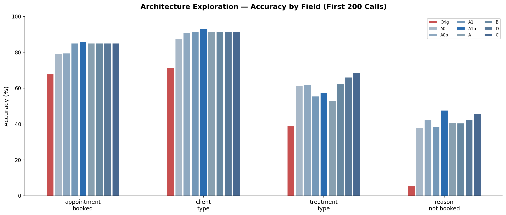
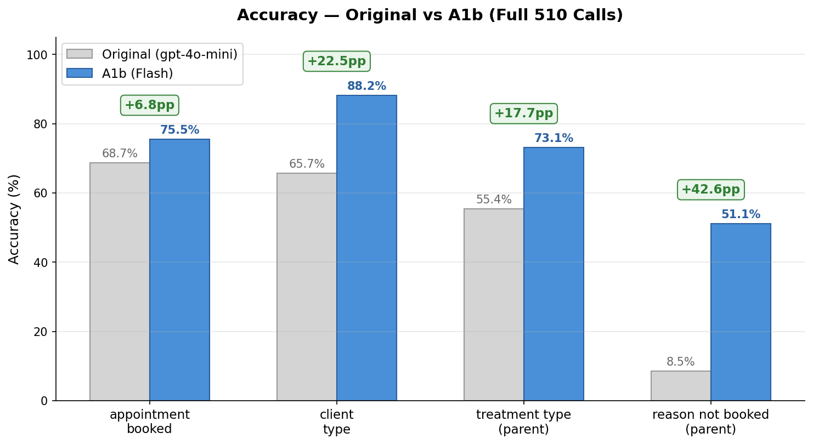

# CallRail Transcript Classification — Prompt Engineering Summary

## Handover: 2 Actions Required

**Action 1: Replace Script 03** — Swap the old `Script 03` with the updated version included in this delivery. No other scripts (01, 02, 04, 05) need to change.

**Action 2: Add 2 lines to your `.env` file:**
```
GEMINI_API_KEY=your-gemini-key
GEMINI_BASE_URL=https://generativelanguage.googleapis.com/v1beta/openai/
```

**Verify before deploying** — run a dry run to confirm your environment and DB connection are working:
```
python "03_CallRail_Transcripts_Analyze_Buckets_vDS.py" --dry-run
```
This checks env vars, connects to the database, and shows how many calls are queued without calling the API.

---

## Background

We have 510 call transcripts labeled by the VetCare team across 4 classification fields: appointment_booked, client_type, treatment_type, and reason_not_booked. We used this labeled dataset to develop a new prompt that is more accurate and more reliable than the existing implementation.

The problem with the existing prompt is that it is too open-ended. It does not include guardrails, structured examples, or best practices in prompt engineering. This means it performs reasonably on simple classification tasks (e.g., "was an appointment booked?") but becomes non-deterministic and unreliable on harder tasks (e.g., "what type of treatment was discussed?" or "why wasn't an appointment booked?"). The outputs on these harder fields are essentially random.

There is a ceiling to what prompt engineering alone can achieve — but by applying best practices systematically, we can significantly improve accuracy and reliability without fine-tuning a model.

Techniques we applied:
- **Few-shot prompting** — providing labeled examples directly in the prompt so the model learns the expected output pattern
- **Strict JSON schemas** — constraining the model's output to valid enum values, eliminating format errors
- **Architecture search** — testing different call structures (single-call vs. multi-call with context passing)
- **Batch size optimization** — finding the right number of transcripts per API call for each model
- **Model comparison** — testing across Gemini Flash, GPT-4o-mini, GPT-4o, Gemini Pro, and GPT-5

Fine-tuning would be the ultimate goal for maximizing accuracy, but it is significantly more laborious and resource-intensive — requiring curated training data, compute resources, and ongoing maintenance.

<div style="page-break-before: always;"></div> 
---

## Baseline: Original Script Performance (All 510 Calls)

We ran the existing script (gpt-4o-mini, original prompt, no strict schema, bs=8) on all 510 labeled calls.

| Field | Strict Accuracy | Parent-Level Accuracy |
|---|---|---|
| appointment_booked | 68.7% | — |
| client_type | 65.7% | — |
| treatment_type | 32.9% | 55.4% |
| reason_not_booked | 4.6% | 8.5% |

*Parent-level accuracy counts a prediction as correct if it matches the right parent category (e.g., predicting "Urgent Care – Diagnosis and Treatment" when gold says "Urgent Care / Sick Pet" counts as correct at parent level, since the model identified the right clinical area but over-specified to a sub-category).*

**Summary:** The original script does relatively well on the straightforward fields — appointment_booked (68.7%) and client_type (65.7%) are simple yes/no/existing/new decisions with clear signals. But it struggles significantly on treatment_type (32.9% strict, 55.4% parent) and reason_not_booked (4.6% strict, 8.5% parent), where the classification requires understanding veterinary context, distinguishing between similar categories, and handling ambiguous cases. reason_not_booked is essentially non-functional.

---

## Architecture Exploration (First 200 Calls)

We iterated across multiple architectural designs and prompt strategies. Testing was done on the first 200 calls to keep costs low while iterating rapidly. The original script is shown in red; optimized architectures progress from light grey to dark blue.



<div style="page-break-before: always;"></div> 

| Option | Description | Cost (60K calls) |
|---|---|---|
| **Original** | gpt-4o-mini, original prompt, no schema, bs=8 | $34 |
| **A0** | Flash, v9 prompts + strict schema, bs=15 | $34 |
| **A0b** | Flash, improved prompts, single call, bs=15 | $34 |
| **A1** | Flash, 2-call: appt separate + 3 fields combined, bs=15 | $68 |
| **A1b** | Flash, 2-call with context passing, bs=15 | $68 |
| **A** | Flash, 4-call field-decomposed, bs=15 | $115 |
| **B** | Flash + GPT-4o hybrid | $838 |
| **D** | Flash + Gemini Pro hybrid (1,000 calls/day rate limit) | $534 |
| **C** | Flash + GPT-5 hybrid | $2,984 |

**A1b is the most cost-efficient and reliable design.** It achieves the best average accuracy of any Flash-only option (71.1%) at just $68 per 60K calls — 2x the original cost for +25pp accuracy. Each architecture has been optimized and appears to have reached its ceiling with a non-fine-tuned model and the available labeling data. The labeling data contains only labels without reasoning — there is no explanation of *why* a label was assigned, which limits how precisely the prompt can learn the labeler's intent.

While the hybrid options (B, D, C) show higher treatment_type accuracy by using more expensive models, they come with significant practical limitations beyond cost. Gemini Pro in particular has a rate limit of only 1,000 API calls per day on the free/standard tier, which would be a hard bottleneck for VetCare's call volume. At 60K calls requiring ~16,000 API calls, that's 16 days just to process one month of data — not viable for production.

### A1b Architecture

```
Call 1: Flash (bs=15) → appointment_booked only
                          ↓ result passed as context
Call 2: Flash (bs=15) → client_type + treatment_type + reason_not_booked
```

- 2 API calls per batch of 15 transcripts
- 60K transcripts: ~8,000 API calls total
- appointment_booked gets its own dedicated call for higher accuracy
- The remaining 3 fields share cross-field context, which improves treatment_type and reason_not_booked
- reason_not_booked receives the appointment_booked result, eliminating cascade errors

---
<div style="page-break-before: always;"></div> 

## Key Findings

1. **Prompt engineering alone delivered +25pp at the same cost tier.** The jump from original (gpt-4o-mini, 45.9% avg) to A0 (Flash + v9 prompts, 66.5% avg) came from better prompts, strict schemas, and model upgrade — all at $34/60K calls.

2. **Splitting appointment_booked into its own call gains +6.5pp on that field.** When the model focuses on one clear question, it performs significantly better. But fully decomposing all fields into separate calls (option A) hurts treatment_type because the model loses cross-field context.

3. **Passing context between calls is critical.** A1b passes the appointment_booked result into Call 2. This recovered reason_not_booked (+9pp over the version without context) and improved treatment_type (+2pp). Cross-field reasoning matters.

4. **More expensive models help treatment_type, not much else.** GPT-5 improves treatment_type by +16pp over Flash, but costs 44x more. appointment_booked and client_type don't benefit from stronger models — Flash is sufficient for those fields.

5. **Flash handles batching well; other models don't.** Flash maintains accuracy at bs=15 (ideal for production throughput). GPT-4o-mini degrades by -14pp at bs=5. GPT-5 is stable at bs=5 but degrades at bs=10.

6. **~30% of reason_not_booked errors cascade from appointment_booked.** When the model misclassifies a "No" call as "Inconclusive," reason_not_booked gets skipped (null). Fixing appointment_booked accuracy is the biggest lever for improving reason_not_booked.

7. **treatment_type has a structural ceiling (~65-73% parent-level) due to gold label quality.** 19% of calls have specific sub-category gold labels but no medical keywords in the transcript — the label was likely assigned from CRM/appointment data, not transcript content. The model cannot derive these labels from the transcript alone.

8. **Simpler prompts outperform complex rules.** Stripping 3,000 tokens of rules and decision trees and replacing them with clear examples improved accuracy. Every rule that fixed one error pattern broke another.

---
<div style="page-break-before: always;"></div> 

## Selected Architecture: A1b vs. Original (Full 510 Calls)



The A1b architecture is dramatically more reliable, especially on the harder fields. reason_not_booked goes from essentially non-functional (8.5% parent) to a usable signal (51.1% parent). treatment_type improves from coin-flip accuracy to 73.1% at the parent level.

The gap between strict and parent accuracy (52% → 73% for treatment_type) shows the model is identifying the right clinical area but over-specifying to sub-categories. This is a prompt tuning issue, not a fundamental accuracy problem.

---

## Next Steps

There are two paths to further improvement:

### 1. Fine-tune the model
Training a custom model on the 510 labeled examples would teach it the exact labeling conventions. This is the highest-ceiling approach but is resource-intensive: it requires curated training data in the right format, compute costs for training, and ongoing maintenance when labels or categories change. Not recommended at this stage unless the label set is stable and well-validated.

### 2. Improve and expand the gold labels
Many of the remaining errors trace back to gold label quality rather than prompt limitations:
- **19% of calls** have sub-category labels with no transcript evidence — these may have been labeled from CRM data, not the transcript
- **Labels lack reasoning** — we only know *what* the label is, not *why*. Adding rationale to even 50-100 key examples would help the prompt learn edge-case logic
- **Cascade sensitivity** — a small improvement in appointment_booked accuracy would cascade into large gains for reason_not_booked

Recommended immediate actions:
- Audit the ~100 calls where treatment_type gold labels have no transcript evidence
- Add labeling rationale to the most commonly confused categories (e.g., "Urgent Care / Sick Pet" vs. "Urgent Care – Diagnosis and Treatment")
- Review appointment_booked labels for calls currently classified as Inconclusive — many may be clear Yes or No

---

## Script 03 Update — A1b Implementation

The production script (`03_CallRail_Transcripts_Analyze_Buckets_vDS.py`) has been updated to use the A1b architecture.

### What Changed

| Component | Before | After |
|-----------|--------|-------|
| Model | `gpt-4o-mini` | `gemini-2.5-flash` |
| API client | OpenAI direct | Gemini via OpenAI-compatible endpoint |
| API key | `OPENAI_API_KEY` | `GEMINI_API_KEY` → `LLM_API_KEY` → `OPENAI_API_KEY` fallback chain |
| Prompts | Single `SYSTEM_PROMPT` (1 call) | A1b: `V9_APPOINTMENT_BOOKED_PROMPT` + `A1B_COMBO_PROMPT` (2 calls) |
| Response format | `{"type": "json_object"}` | Strict JSON schemas with enums |
| Combo prompt | N/A | Includes name extraction (Field 4) |
| Batch size | 8 | 15 |
| Analysis version | `prod_v1` | `prod_vDS` |
| Pipeline | `call_openai_batch()` — 1 API call | `call_llm_batch()` — Call 1 (appointment) → group by answer → Call 2 (3 fields + names) |

### What Did NOT Change

- `setup_logging()`, `parse_args()`, `get_db_connection()`, `get_next_analysis_version()`
- `fetch_unanalyzed_calls()` — same SQL query
- `normalize_null()`, `convert_results_to_rows()` — same output dict keys
- `upsert_analysis()` — same SQL, same parameter order
- `process_backlog()` loop structure — same fetch→batch→process→upsert flow
- `main()` — same version/prefix/CLI logic
- All imports (no new dependencies)

### .env Additions

Add 2 lines to your `.env` file:

```
GEMINI_API_KEY=your-gemini-key
GEMINI_BASE_URL=https://generativelanguage.googleapis.com/v1beta/openai/
```

Everything else stays. `OPENAI_API_KEY` still works as fallback.

### Compatibility Verification

We verified the updated script against the original and all other pipeline scripts (01–05) to confirm it is a safe drop-in replacement.

| Check | Status | Detail |
|-------|--------|--------|
| `upsert_analysis()` SQL | Identical | Same UPDATE/INSERT columns, same parameter order, same binding |
| `convert_results_to_rows()` output | Identical | Same 8 dict keys, same fallback defaults, same null normalization |
| `fetch_unanalyzed_calls()` SQL | Identical | Same LEFT JOIN, same WHERE clause, same ORDER BY |
| Table/column names | Identical | Same defaults, same env var overrides |
| Downstream scripts (04, 05) | Safe | Neither reads `CallRailAPI_TranscriptAnalysis` directly; Script 05 uses a SQL view |
| Upstream scripts (01, 02) | Safe | Neither writes to or references the analysis table |
| Cross-script env vars | No conflicts | `GEMINI_API_KEY` and `GEMINI_BASE_URL` are new; `SQLSERVER_*` vars shared and handled identically |
| pip dependencies | Unchanged | Same `openai`, `pyodbc`, `python-dotenv` — no new packages |
| Error handling | Equivalent | Batch-level retry (3 attempts); failed batches skipped and re-fetched next iteration |

**Notes:**
- `analysis_version` changes from `prod_v1` to `prod_vDS` in new rows. No script or query filters on this value, but if any reporting dashboards do, they would need updating.
- `GEMINI_API_KEY` is required. The fallback to `OPENAI_API_KEY` provides the key but still points at the Gemini endpoint, so it would not fall back to OpenAI automatically.
